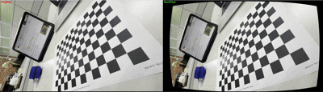
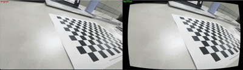

# camera-calibrator

Camera calibration and lens distortion correction using OpenCV

### 📊 Camera Calibration Results

```text
* RMS error (rmse): 0.8803
* Camera matrix (K):
  [[887.94022777   0.         955.04429227]
   [  0.         883.53091051 526.74577586]
   [  0.           0.           1.        ]]
  - fx: 887.9402
  - fy: 883.5309
  - cx: 955.0443
  - cy: 526.7458
* Distortion coefficients: [ 0.01344663 -0.00864333 -0.00495863 -0.00333522  0.00670217]

(※ p1, p2, k3를 0으로 강제 초기화하여 오버피팅 방지)
  dist_coeff = np.array([-0.01492128, 0.1062357, 0.0, 0.0, 0.0])
```

---

### 🎬 Lens Distortion Correction Demo (Original vs Rectified)

<div align="center">
  
  <br><br>
  
  converting
  
</div>
